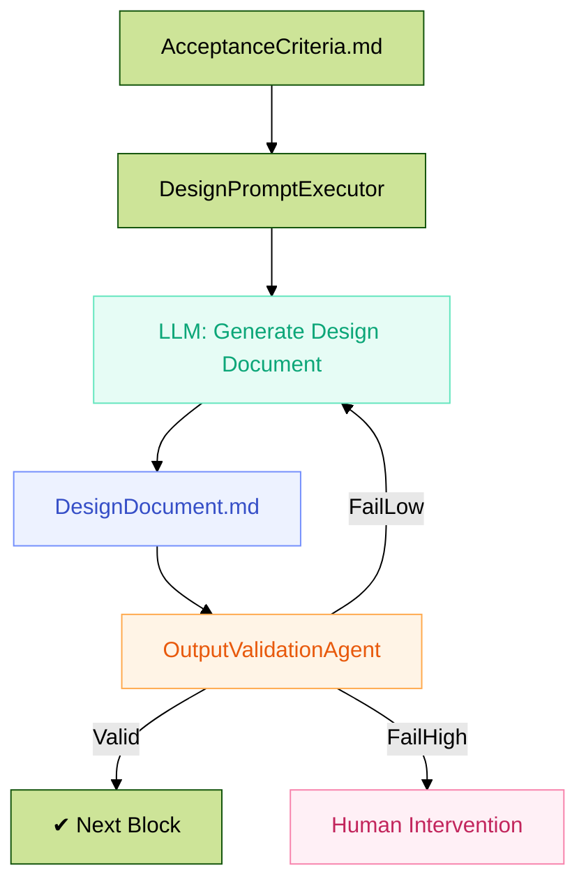
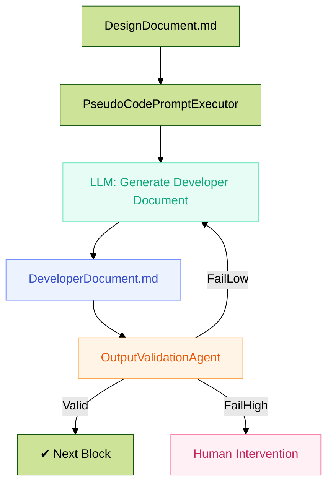
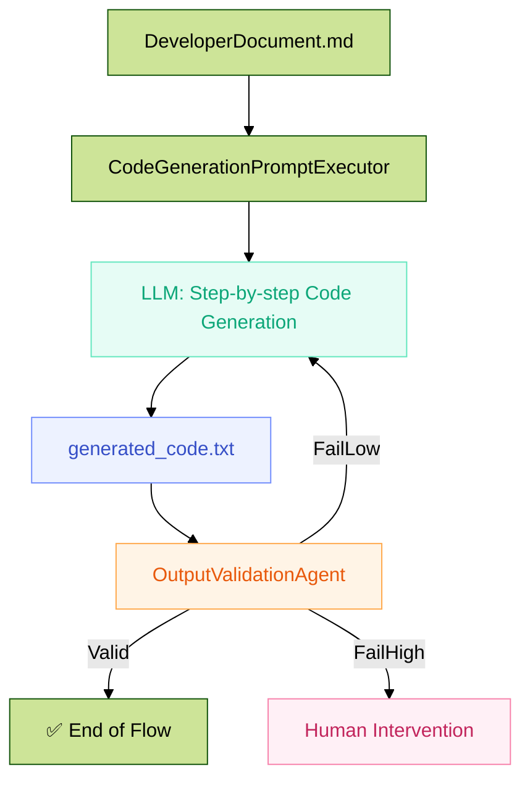
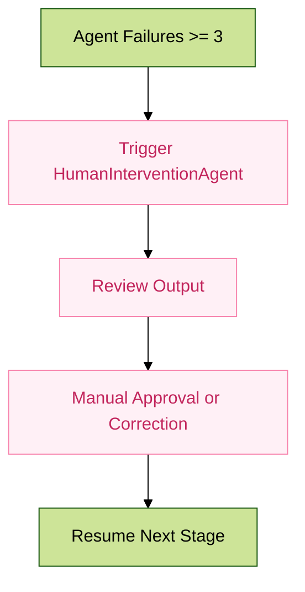

# 🧠 SDLC Agent Workflow  
**(Agentic AI + A2A + LandGraph + TDD + Retry Thresholds + Human Oversight)**

---

## 📏 Architecture Overview

| Component              | Description                                |
|------------------------|--------------------------------------------|
| **Agent Framework**    | Agentic AI                                 |
| **Coordination Layer** | A2A (Agent-to-Agent communication)         |
| **Flow Control**       | LandGraph                                  |
| **Main Stages**        | Prompt Creation → Validation → Execution → Output Validation → Human Intervention if needed |

---

## 🔁 End-to-End Workflow

### 1️⃣ Requirement Analysis Step
- **Task:** Read requirement from requirements text/Jira story.
- **Analysis Prompt Executor:** Uses the Analysis Prompt template and replaces the placeholder text in the Prompt Template with Requirements.md file.
- **Prompt Execution:** Executes the prompt and saves the output in `AcceptanceCriteria.md`.
- **Output Validation Agent:** Validates the acceptance criteria (max 3 retries → human fallback).

---

### 2️⃣ Design Step
- **Design Prompt Executor:** Uses the Design Prompt Template and replaces the placeholder text in the Prompt Template with Requirement text and Acceptance Criteria from `AcceptanceCriteria.md` (generated from Requirement Analysis step).
- **Prompt Execution:** Executes the prompt and saves the output in `DesignDocument.md`.
- **Output Validation Agent:** Validates the design document (max 3 retries → human fallback).

---

### 3️⃣ Pseudo Code Generation Step
- **Pseudo Code Prompt Executor:** Uses the Developer Prompt Template and replaces the placeholder text in the Prompt Template with Requirement, Acceptance Criteria from `AcceptanceCriteria.md`, and `DesignDocument.md`.
- **Prompt Execution:** Executes the prompt and saves the output in `DeveloperDocument.md`.
- **Output Validation Agent:** Validates the developer document (max 3 retries → human fallback).

---

### 4️⃣ Code Generation Step
- **Code Generation Prompt Executor:** Uses the `DeveloperDocument.md` and asks the LLM to write code step by step, where each step can be executed one after another on human approval.
- **Output Validation Agent:** Validates the final code (max 3 retries → human fallback).

---

## 🔄 Retry & Intervention Logic

| Stage                  | Agent                   | Max Retries | On Max Failure         |
|------------------------|--------------------------|-------------|-------------------------|
| Output Validation      | `OutputValidationAgent`   | 3           | `HumanInterventionAgent` |

---

## 📁 Output Artifacts

| File Name                   | Description                                  |
|----------------------------|----------------------------------------------|
| `requirements.txt`         | From Jira                                    |
| `AcceptanceCriteria.md`    | From requirements analysis                   |
| `DesignDocument.md`        | From design step                             |
| `DeveloperDocument.md`     | From pseudo code generation                  |
| `generated_code.txt`       | Final code based on prior stages             |

---

## 🧰 Agent Summary

| Agent Name                     | Role                                                                 |
|--------------------------------|----------------------------------------------------------------------|
| `AnalysisPromptExecutor`       | Executes analysis prompt template for requirements                   |
| `DesignPromptExecutor`         | Executes design prompt template for design                           |
| `PseudoCodePromptExecutor`     | Executes developer prompt template for pseudo code                   |
| `CodeGenerationPromptExecutor` | Executes code generation using developer document                    |
| `OutputValidationAgent`        | Validate LLM output files (max 3 retries)                            |
| `HumanInterventionAgent`       | Triggered if retries exhausted at any stage                          |

---

## 📊 Modular Mermaid Flowcharts

### 🔹 Block 1: Requirement → Acceptance Criteria
```mermaid
---
config:
  layout: dagre
  look: classic
  theme: forest
---
flowchart TD
    A[Requirement (Jira/requirements.txt)] --> B[AnalysisPromptExecutor]
    B --> C[LLM: Generate Acceptance Criteria]
    C --> D[AcceptanceCriteria.md]

    D --> E[OutputValidationAgent]
    E -->|Valid| Z[✔ Next Block]
    E -->|FailLow| C
    E -->|FailHigh| H1[Human Intervention]

    classDef retry fill:#fff4e6,stroke:#ffa94d,color:#e8590c;
    classDef success fill:#e6fcf5,stroke:#63e6be,color:#0ca678;
    classDef artifact fill:#edf2ff,stroke:#748ffc,color:#364fc7;
    classDef human fill:#fff0f6,stroke:#f783ac,color:#c2255c;

    class D artifact;
    class H1 human;
    class C success;
    class E retry;
```

### 🔹 Block 2: Acceptance Criteria → Design Document


### 🔹 Block 3: Design Document → Developer Document (Pseudo Code)


### 🔹 Block 4: Developer Document → Code Generation


### 🔹 Block 5: Human Intervention Policy
